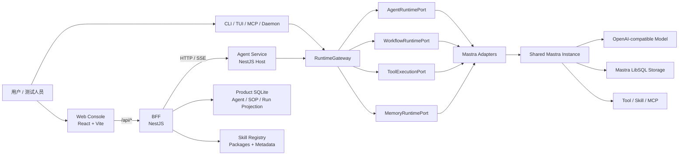

<p align="center">
  
</p>

<h1 align="center">Orbit — All-in-One Agent Workbench</h1>

<p align="center">
  基于统一 Mastra Runtime 的一体化 Agent 配置、测试、运行与发布工作台。
</p>

本仓库使用版本化的 instructions、model、Tools、Skills、Memory policy、Workflow、output schema 和 runtime policy 组合出不同 Agent，并通过同一套 Mastra Runtime 执行。Web、BFF、Skill Hub、SOP Builder 与 Runtime 之间使用稳定的产品协议隔离，业务层不直接依赖 Mastra DSL、内部 step graph 或 snapshot 格式。

> 当前 Runtime 状态：**Mastra-only**
>
> 锁定版本：`@mastra/core@1.52.1`
>
> OpenSpec Stage E：`106/106` 任务完成
>
> 已知能力限制：`parallelMerge = false`，其余 Stage E capability 已通过门禁

## 目录

- [产品定位](#产品定位)
- [设计原则与产品边界](#设计原则与产品边界)
- [系统架构](#系统架构)
- [核心领域模型](#核心领域模型)
- [Runtime Ports](#runtime-ports)
- [Workflow 与 Human Approval](#workflow-与-human-approval)
- [能力矩阵](#能力矩阵)
- [仓库结构](#仓库结构)
- [环境要求](#环境要求)
- [快速启动](#快速启动)
- [环境变量](#环境变量)
- [主要 API](#主要-api)
- [数据、持久化与清理](#数据持久化与清理)
- [安全与生产部署](#安全与生产部署)
- [开发、测试与发布门](#开发测试与发布门)
- [OpenSpec 工作流](#openspec-工作流)
- [Legacy Runtime 归档](#legacy-runtime-归档)
- [当前状态与路线边界](#当前状态与路线边界)
- [相关文档](#相关文档)

## 产品定位

本项目是 **All-in-One Agent Workbench**，主要产品对象是可配置、可测试、可发布、可重现的 Agent，而不是 BPM、审批中心或通用业务流程平台。

一个 Agent 由以下版本化配置共同定义：

- instructions 与系统提示词；
- model 与模型策略；
- Tool allowlist、执行策略与安全边界；
- Skill bindings 与发布版本；
- Memory policy 与 owner/resource/thread 隔离策略；
- Workflow/SOP 编排；
- output schema；
- runtime policy、资源预算与 capability 要求。

平台提供四类核心能力：

1. **配置**：管理 AgentProfile、Skill、WorkflowDraft、节点、变量、策略和绑定关系。
2. **测试**：在不破坏已发布版本的前提下测试 Agent、Workflow 节点和完整 SOP。
3. **运行**：通过统一 Runtime Ports 进入 Mastra，支持流式事件、查询、取消、恢复和重启恢复。
4. **发布**：生成不可变 AgentVersion、WorkflowVersion、contentHash 和受控运行依赖。

## 设计原则与产品边界

### 1. Mastra 是唯一生产 Runtime

生产装配固定为：

```text
NestJS Host
→ RuntimeGateway
→ Agent / Workflow / Tool / Memory Ports
→ Mastra Adapters
→ Shared Mastra Instance
```

系统不存在 Legacy backend selector、双 Runtime 路由或自研 Runtime fallback。框架能力不满足产品语义时，对应 capability 必须保持关闭，不允许在 Adapter 内隐藏实现第二套 scheduler、任务队列或 snapshot engine。

### 2. 产品协议与 Runtime 框架隔离

Web、BFF 和共享包只依赖 `@orbit/workflow-core` 与 `@orbit/runtime-contracts`。Mastra 类型、chunk、step key、snapshot JSON 和内部执行图不得泄漏到产品层。

### 3. Workflow 是 Agent 的内部编排能力

Workflow 可以独立设计、发布和测试，但其产品目的仍是构成 Agent 能力。平台不提供业务流程实例运营、组织审批、用户任务中心或跨运行待办管理。

### 4. 配置状态、运行状态和业务状态严格分离

| 状态类型 | 示例 | 保存策略 |
| --- | --- | --- |
| 产品配置 | AgentProfile、AgentVersion、WorkflowDraft、WorkflowVersion、Skill binding、contentHash | 可版本化长期保存 |
| Run 技术状态 | runId/nativeRunId mapping、Mastra snapshot、SSE 游标、waiting interrupt、幂等 receipt | 必须绑定具体 run，并具有 TTL 或终态清理 |
| 用户业务状态 | 全局审批待办、审批人组织关系、跨运行审批状态、业务流程实例 | 平台不得持有 |

### 5. 失败必须明确可见

缺少模型、身份、不可变版本、capability、合法 schema 或运行恢复条件时，系统应尽早返回结构化错误，不静默 fallback 到其他 Agent、其他 WorkflowVersion 或 Legacy Runtime。

## 系统架构



### 各层职责

| 层 | 职责 | 不应承担的职责 |
| --- | --- | --- |
| Web Console | Agent、Skill、SOP 的配置与测试 UI；消费 BFF DTO/SSE | 直接访问 Runtime 文件或 Mastra API |
| BFF | 产品 API、草稿/版本、Skill Hub、运行代理、SSE 解码与短期投影 | 复制 Mastra snapshot 或维护第二套执行状态机 |
| Agent Service | NestJS HTTP Host、RuntimeGateway 装配、健康检查、内部 Runtime API | 产品页面状态和业务审批管理 |
| Runtime Ports | 稳定的 Agent/Workflow/Tool/Memory 产品运行协议 | 暴露第三方框架内部类型 |
| Mastra Adapters | 编译、身份映射、执行、事件归一化、snapshot 恢复 | 自研通用 scheduler、队列或 fallback Runtime |
| workflow-core | Workflow 文档、节点注册表、IR、校验、能力矩阵 | HTTP、数据库或 UI 状态 |
| Skill Registry | Skill 包、版本、元数据、发布与下载 | Agent/Workflow 执行状态 |

## 核心领域模型

### AgentProfile 与 AgentVersion

- `AgentProfile` 是可编辑的 Agent 草稿配置。
- `AgentVersion` 是不可变发布快照，包含 instructions、Tool policy、Skill policy、output schema、contentHash 和发布元数据。
- Workflow Agent 节点只能绑定已发布的固定 AgentVersion。
- 运行时不得重新读取当前可变 AgentProfile，也不得由 Workflow 请求扩大 Tool 白名单。

### WorkflowDraft 与 WorkflowVersion

- `WorkflowDraft` 支持画布编辑、自动保存、导入导出和发布前校验。
- `WorkflowVersion` 是不可变发布版本，生产运行必须绑定固定版本与 contentHash。
- `Workflow IR v2` 是产品层到 Runtime Adapter 的稳定编译结果，不等同于 Mastra 内部 Workflow DSL。

### Skill

- Skill Hub 负责 Skill catalog、下载、上传、安装、更新、回滚和卸载。
- Agent 绑定使用版本化 Skill policy；发布后不会因为 catalog 更新而静默切换版本。
- BFF 写入的本地 Skill package root 与 Agent Runtime 读取路径必须一致。

### Memory

- Memory 通过 `MemoryRuntimePort` 和共享 Mastra Memory/storage 访问。
- ownerId、resourceId、threadId 是隔离边界。
- Workflow 中的 Agent 节点默认使用隔离 thread，不与其他节点或用户对话隐式共享 Memory。

## Runtime Ports

共享协议位于 [`packages/runtime-contracts/`](packages/runtime-contracts/)。

| Port | 主要能力 |
| --- | --- |
| `AgentRuntimePort` | generate/stream、run query、cancel、Tool/usage 事件、session memory |
| `WorkflowRuntimePort` | start、get、events、cancel、通用 interrupt resume、snapshot/restart recovery |
| `ToolExecutionPort` | Tool catalog、参数验证、权限与安全检查、执行、审计与结构化错误 |
| `MemoryRuntimePort` | thread 创建/查询/删除、message 追加与分页读取、owner/resource 隔离 |

Runtime Ports 同时服务于对话运行和 Workflow 运行，但上层命令保持领域区分：

- 对话请求进入 `AgentRuntimePort`；
- Workflow/SOP 请求进入 `WorkflowRuntimePort`；
- Workflow 中的 Agent 节点通过 `AgentRuntimePort` 创建稳定 child Agent run；
- 两者最终都使用同一个 Mastra Runtime 基座。

## Workflow 与 Human Approval

### Workflow 节点

当前共享节点注册表包括：

- P0：Start、End、LLM、Tool、HTTP、Code、Condition；
- Stage E：Parallel、Merge、Iteration、Loop、Subworkflow、Agent、Human Approval。

节点类型、配置 schema、默认值、端口、校验器和 executor identity 均来自 `workflow-core`，Web、BFF 和 Agent 不重复定义近似协议。

### Human Approval 的正确边界

Human Approval 是具体 Workflow run 中的 **runtime interrupt**，不是独立审批产品。

运行链路：

```text
Human Approval node
→ Mastra step suspend
→ run.waiting(runId + interruptId + redacted fields/schema/deadline)
→ POST /api/workflow-runs/:runId/resume
→ WorkflowRuntimePort.resume
→ 恢复同一个 Mastra run
→ approved / rejected / timeout route
```

必须满足：

- Inspector 保留 displayFields、decisionSchema、approve/reject 分支、deadline、timeout 和 timeoutPolicy；
- waiting 卡片只在当前 SOP 测试 run 真正进入 waiting 时出现；
- approve/reject 必须恢复同一个 run，并只执行对应输出分支；
- schema 校验失败时 run 保持 waiting；
- 重复决定使用 idempotencyKey 保持稳定结果，冲突决定返回明确 conflict；
- 页面重连通过同一 run snapshot/SSE 重建卡片；
- Mastra snapshot 是 waiting、已完成 step、恢复位置和终态的唯一权威源；
- run mapping、事件和最小 decision receipt 必须具有 retention/TTL。

明确禁止：

- 审批收件箱、全局审批列表、审批详情和审批历史页面；
- `ApprovalRequest` 产品实体、Approval Repository 或审批业务表；
- `/api/approvals`、`/api/approvals/:id`、`/internal/approvals`；
- 脱离 runId 的查询或决定操作；
- 在 Agent→Workflow 对话调用链尚未实现时伪造聊天审批界面。

> CLI 中用于高风险 Tool 执行的本地安全授权属于安全控制机制，不是 Workflow Human Approval，也不是业务审批产品。

## 能力矩阵

生产默认矩阵由 BFF 发布门与 Agent 启动门共享：

| Capability | 当前状态 | 说明 |
| --- | --- | --- |
| `parallelMerge` | 关闭 | Mastra foreach fail-fast 不能取消已经活动的 sibling；不使用自研 scheduler 兜底 |
| `iteration` | 开启 | 数组上限、并发 1–10、稳定 instance/index、失败策略和恢复已通过 |
| `boundedLoop` | 开启 | while/until、最大次数、总时长、取消和重启恢复已通过 |
| `nestedWorkflow` | 开启 | 固定版本、最大深度、childRunId、错误链和恢复已通过 |
| `agentNode` | 开启 | 固定 AgentVersion、隔离 Memory、Tool/Skill policy 和 cancel 已通过 |
| `humanApproval` | 开启 | run-scoped waiting/resume、approve/reject、幂等、超时、取消和 TTL 已通过 |
| `restartResume` | 开启 | Loop、Subworkflow、Agent node 和 Human Approval 重启恢复已通过 |

包含关闭 capability 的草稿可以被保存，但不得发布或进入生产运行。

## 仓库结构

```text
.
├── apps/
│   ├── agent-cli/          # CLI/TUI/MCP/Daemon、NestJS Agent Service、Mastra Runtime
│   ├── bff/                # Web BFF、Agent/SOP/Skill 产品 API、SQLite repositories
│   ├── web-console/        # React + Vite Agent Workbench
│   └── skill-registry/     # 独立 Skill Registry 服务
├── packages/
│   ├── runtime-contracts/  # 四类稳定 Runtime Port 与跨端 DTO
│   └── workflow-core/      # Workflow contracts、registry、IR、compiler、validation
├── archive/
│   └── legacy-agent-runtime/ # frozen/read-only/non-production 历史源码
├── openspec/               # proposal、design、spec、tasks 与 archive
├── prd/                    # 历史和增量 PRD
├── docs/                   # 架构术语和仓库说明
├── registries/             # 默认 Skill Registry seed/package metadata
├── scripts/                # 静态边界和工程检查
├── python/                 # 教学演进示例，不属于生产 Runtime
├── typescript/             # 教学演进示例，不属于生产 Runtime
├── AGENTS.md               # 当前工作区唯一执行规则源
└── pnpm-workspace.yaml     # pnpm workspace 定义
```

## 环境要求

- Node.js `22+`；
- pnpm `10.18.3`；
- 可访问的 OpenAI-compatible 模型服务；
- 可选：Docker / Docker Compose，用于独立 Skill Registry；
- 本地开发建议使用 macOS 或 Linux。Windows 可运行 Node 服务，但 Bash sandbox、路径和 shell 行为需要单独验证。

安装依赖：

```bash
pnpm install --frozen-lockfile
```

## 快速启动

### 1. 配置模型

创建或更新 `apps/agent-cli/.env`：

```dotenv
MODEL_ID=your-model-id
OPENAI_API_KEY=your-api-key
OPENAI_BASE_URL=https://your-openai-compatible-endpoint/v1
```

`OPENAI_BASE_URL` 可省略；历史变量 `OPENAI_BASEURL` 仍兼容，但新配置统一使用 `OPENAI_BASE_URL`。

### 2. 启动完整本地 Workbench

分别在四个终端执行：

```bash
# Terminal 1：Skill Registry（完整 Skill Hub 需要）
pnpm dev:skill-registry

# Terminal 2：Agent Service / Mastra Runtime
pnpm --filter agent-cli dev:server

# Terminal 3：BFF
pnpm dev:bff

# Terminal 4：Web Console
pnpm dev:web
```

默认地址：

| 服务 | 地址 | 用途 |
| --- | --- | --- |
| Web Console | `http://127.0.0.1:5173` | Agent、Skill、SOP 配置与测试 |
| BFF | `http://127.0.0.1:3182` | 公共产品 API 与 SSE |
| Agent Service | `http://127.0.0.1:3181` | 内部 Agent/Workflow/Tool/Memory Runtime API |
| Skill Registry | `http://127.0.0.1:3190` | Skill catalog、package 与管理接口 |

健康检查：

```bash
curl http://127.0.0.1:3181/health
curl http://127.0.0.1:3181/ready
curl http://127.0.0.1:3182/api/health
```

Agent health 的 Runtime mode 应为 `mastra-only`。

### 3. 仅启动 CLI/TUI

```bash
pnpm dev:agent
pnpm --filter agent-cli dev:tui
pnpm --filter agent-cli dev:tui-ink
```

CLI、TUI、MCP 和 Daemon 会复用现有 AgentService/RuntimeGateway 装配；若本地 daemon 可复用则优先 attach，否则使用 embedded host。

### 4. Docker 启动 Skill Registry

```bash
pnpm docker:skill-registry
```

Compose 将数据挂载到仓库的 `runtime/skill-registry/`。默认管理 token 仅适用于本地开发，生产环境必须覆盖。

## 环境变量

### Agent Service

| 变量 | 默认值 | 说明 |
| --- | --- | --- |
| `MODEL_ID` | 无 | 必填，OpenAI-compatible model id |
| `OPENAI_API_KEY` | 无 | 模型服务凭据；使用无鉴权本地网关时可由网关策略决定 |
| `OPENAI_BASE_URL` | SDK 默认 | OpenAI-compatible base URL |
| `AGENT_HTTP_PORT` | `3181` | Agent HTTP service 端口 |
| `AGENT_BASH_SANDBOX_MODE` | `workspace-write` | `off`、`workspace-write`、`strict-readonly` |
| `AGENT_SESSION_RETENTION_DAYS` | `14` | session 与 run 技术状态保留期基线 |
| `AGENT_TRANSCRIPT_RETENTION_DAYS` | `7` | transcript 保留期 |
| `AGENT_PRIVACY_PERSISTENCE_MODE` | `default` | `default` 或 `disabled` |
| `AGENT_PRIVACY_MEMORY_MODE` | `default` | `default`、`manual_only`、`disabled` |
| `AGENT_PRIVACY_OBSERVABILITY_MODE` | `default` | `default`、`minimal`、`disabled` |
| `AGENT_PRIVACY_REMOTE_ATTACH_MODE` | `default` | `default` 或 `local_only` |
| `AGENT_PRIVACY_EXTERNAL_CAPABILITIES_MODE` | `default` | `default`、`disabled`、`allowlist` |
| `AGENT_PRIVACY_MCP_ALLOWLIST` | 空 | 逗号分隔的 MCP allowlist |

模型预算、恢复、MCP、Hook、后台任务、上下文压缩和输出限制的完整默认值位于 [`apps/agent-cli/src/runtime-config.ts`](apps/agent-cli/src/runtime-config.ts)。

### BFF

| 变量 | 默认值 | 说明 |
| --- | --- | --- |
| `BFF_PORT` | `3182` | BFF HTTP 端口 |
| `AGENT_SERVICE_BASE_URL` | `http://127.0.0.1:3181` | Agent Service upstream |
| `SKILL_REGISTRY_SERVICE_URL` | `http://127.0.0.1:3190` | Skill Registry 地址 |
| `SKILL_REGISTRY_ADMIN_TOKEN` | 本地开发 token | Registry 管理调用 bearer token |
| `SKILLHUB_DATA_ROOT` | `<cwd>/.data/skills` | BFF Skill package/install 数据目录 |
| `SOP_DATA_ROOT` | `<cwd>/.data/sops` | SOP、版本和 run projection SQLite 目录 |

### Web Console

| 变量 | 默认值 | 说明 |
| --- | --- | --- |
| `VITE_BFF_URL` | `http://127.0.0.1:3182` | Vite `/api` 代理目标 |

### Skill Registry

| 变量 | 默认值 | 说明 |
| --- | --- | --- |
| `SKILL_REGISTRY_PORT` | `3190` | Registry HTTP 端口 |
| `SKILL_REGISTRY_DATA_ROOT` | `<cwd>/runtime/skill-registry` | Registry 数据根目录 |
| `SKILL_REGISTRY_DB` | `<dataRoot>/registry.sqlite` | Registry SQLite 文件 |
| `SKILL_PACKAGE_ROOT` | `<dataRoot>/packages` | Skill package 文件目录 |
| `SKILL_REGISTRY_SEED` | `registries/default-skill-registry.json` | 初始 catalog seed |
| `SKILL_REGISTRY_ADMIN_TOKEN` | 本地开发 token | 管理接口 token |

## 主要 API

### BFF 公共产品 API

Web 只访问 BFF 的 `/api/*`，不直接调用 Agent Service 或读取 Runtime 文件。

| 领域 | 主要接口 |
| --- | --- |
| 健康与设置 | `GET /api/health`、profile、settings |
| Session/Chat | sessions、transcript、messages、message stream、全局 event stream |
| Agent | `/api/agents` CRUD、`POST /api/agents/:agentId/versions` |
| AgentVersion | `GET /api/agent-versions`、`GET /api/agent-versions/:id` |
| Skill Hub | `/api/skills` catalog、registry、upload、install、update、rollback、uninstall、audit |
| SOP | `/api/sops`、import/export、autosave、publish、versions、diff、storage backup/restore |
| SOP Template | `/api/sop-templates` |
| Workflow Run | `POST/GET /api/workflow-runs`、events、cancel、resume |

Workflow Run 的稳定控制接口：

```text
POST /api/workflow-runs
GET  /api/workflow-runs/:runId
GET  /api/workflow-runs/:runId/events
POST /api/workflow-runs/:runId/cancel
POST /api/workflow-runs/:runId/resume
```

SSE 支持 `Last-Event-ID`/游标重连，终态事件后关闭连接。BFF decoder 对未知事件保持向后兼容，产品 event id 在单 run 内严格递增。

### Agent Service 内部 API

| 领域 | 主要接口 |
| --- | --- |
| Health | `/health`、`/ready`、`/info` |
| Chat | `POST /chat`、`POST /chat/stream` |
| Agent Run | `GET /agent-runs/:runId`、cancel |
| Workflow Run | `/workflow-runs` start/get/events/cancel/resume |
| Tool | `/tools`、`POST /tools/call` |
| Memory | `/memory/threads` 与 thread messages |
| Skills | `/skills/resolve` |

Agent Service API 主要供 BFF、本地 CLI/TUI/MCP 和受控内部调用使用。面向公网部署时必须置于认证、授权和网络隔离之后。

## 数据、持久化与清理

### Mastra Runtime 数据

Agent Service 默认将版本化 Mastra 数据写入：

```text
apps/agent-cli/.runtime/mastra/v1/
├── mastra.db
├── mappings/
└── events/
```

其中：

- `mastra.db` 保存 Mastra 原生持久状态和 Workflow snapshot；
- mappings 保存 product run/thread 与 native identity 的最小映射；
- events 保存按 run 分离的产品事件 journal；
- decision receipt 只用于具体 run 的恢复幂等，不表达审批业务状态。

### BFF 产品数据

默认数据根相对于 BFF 工作目录：

```text
.data/
├── bff-business-state.json
├── skills/
└── sops/
    ├── workflows.sqlite
    └── backups/
```

`workflows.sqlite` 保存 SOP 草稿、不可变版本、AgentVersion 和 Workflow run 的产品投影。它不得复制 Mastra 内部 snapshot 或建立 Approval 产品表。

### Skill Registry 数据

本地进程默认使用 `<cwd>/runtime/skill-registry/`；Docker Compose 使用仓库根目录 `runtime/skill-registry/` 持久卷。

### 清理规则

- active/waiting run 数据必须至少保留到 deadline 和合法恢复窗口；
- terminal run 的 mapping、事件和幂等 receipt 在 retention/TTL 后按 run 清理；
- 测试结束后清理 `.tasks`、`.team`、`.worktrees`、`.transcripts`、`tmp` 和本轮生成的临时隐藏目录；
- `.data`、`.runtime`、本地数据库、密钥和运行日志不得提交；
- 不得为方便清理而删除无法确认归属的用户数据。

## 安全与生产部署

当前仓库提供生产级架构边界、运行门禁和测试基线，但默认启动方式仍是 **local-first development setup**。正式部署必须补齐外部基础设施和安全控制。

### 生产部署必须完成

- 使用 Secret Manager 注入模型密钥和 Registry 管理 token；
- 替换默认 `SKILL_REGISTRY_ADMIN_TOKEN`；
- 在 Web/BFF/Agent Service 前配置 TLS、认证、授权、速率限制和请求体上限；
- Agent Service 与 Skill Registry 使用内网或服务网格隔离，不直接暴露公网；
- 为 SQLite/LibSQL 数据目录配置持久卷、备份、恢复演练和容量监控；
- 根据数据分级配置 retention、审计、脱敏和删除策略；
- 根据部署环境选择 `workspace-write` 或 `strict-readonly` Bash sandbox；
- 配置可观测性、告警、进程管理、优雅关闭和健康探针；
- 将 Web `dist/` 部署到受控静态服务器/CDN，`vite preview` 仅用于本地预览；
- 复核 CORS、代理信任、SSRF、MCP allowlist、外部 Tool 和 Skill package 来源。

### 构建与启动

```bash
pnpm build

pnpm --filter skill-registry start
pnpm --filter agent-cli start:server
pnpm --filter agent-bff start
```

Web 构建产物位于 `apps/web-console/dist/`。

## 开发、测试与发布门

### 常用命令

```bash
# 全 workspace
pnpm build
pnpm test
pnpm lint

# 静态 Workflow 边界
pnpm check:workflow-boundaries

# Agent release gate
pnpm release:check

# 分包验证
pnpm --filter @orbit/workflow-core test
pnpm --filter @orbit/runtime-contracts test
pnpm --filter agent-cli test
pnpm --filter agent-bff test
pnpm --filter agent-web-console test
pnpm --filter skill-registry test
```

### Workflow/Mastra 专项

```bash
pnpm --filter agent-cli test:workflow
pnpm --filter agent-cli test:service-api
pnpm --filter agent-cli test:harness
```

### 当前 Mastra 迁移验收基线

截至 2026-07-31：

- Agent release gate：131 files / 526 tests；
- Workflow smoke：13 files / 84 tests；
- Stage E release window：30 runs / 912 events；
- workflow-core：44 tests；
- runtime-contracts：5 tests；
- BFF：52 tests；
- Web：88 tests；
- `pnpm build` 通过；
- 浏览器完成 Human Approval approve/reject、离开 run 无全局待办、聊天无伪造审批和 health `mastra-only` 验收。

测试中的 timeout、abort、step crashed 日志在故障注入用例中可能是预期输出，应以测试终态和断言为准。

### 提交前门禁

1. `pnpm build`；
2. 对应单元、smoke、回归和浏览器验收；
3. `openspec status --change "<name>" --json`；
4. `openspec validate "<name>" --type change`；
5. `git diff --check`；
6. 清理本轮运行产物；
7. 确认 PRD、Legacy 归档和无关 change 没有被误改；
8. 用户验收通过后再使用 Conventional Commits 提交；
9. 不自动 push。

## OpenSpec 工作流

本仓库严格遵守 [`AGENTS.md`](AGENTS.md)：

- OpenSpec 负责需求分析、架构设计、规范和任务拆解；
- 代码实现、测试、调试和运行按 OpenSpec `tasks.md` 执行；
- 不在实现过程中另建与 OpenSpec 竞争的长期计划文档；
- 每个 change 遵循 `new change → artifacts → implement → validate → user acceptance → archive`。

常用命令：

```bash
openspec list --json
openspec status --change "<change-name>" --json
openspec instructions apply --change "<change-name>" --json
openspec validate "<change-name>" --type change
openspec archive "<change-name>" -y
```

重要规则：

- OpenSpec archive 必须在实现完成、验证通过并经用户验收后执行；
- 不为了同步进度自动修改其他 PRD/change 的 tasks；
- 后续 Agent、Workflow、Skill Hub、Memory 和 Runtime change 必须遵守 All-in-One Agent Workbench 上位基线。

## Legacy Runtime 归档

迁移前自研教学版 Runtime 保存在：

[`archive/legacy-agent-runtime/`](archive/legacy-agent-runtime/)

该目录为：

- **Frozen**：不继续开发或修复；
- **Read-only**：仅供架构回顾、教学和代码考古；
- **Non-production**：不是 fallback、rollback backend 或兼容层。

归档目录不包含可执行 package manifest，不加入 pnpm workspace、tsconfig、exports、构建或测试流程。Agent Service、NestJS、RuntimeGateway 和 Mastra Adapter 均不得 import、require 或动态加载归档源码。

根目录 `python/` 和 `typescript/` 同样属于 Agent 工程教学演进示例，不是当前生产 Runtime。

## 当前状态与路线边界

### 已完成

- NestJS Agent Service 与 RuntimeGateway；
- Agent、Workflow、Tool、Memory 四类 Runtime Ports；
- 共享 Mastra Instance、LibSQL storage、流式事件、查询、取消和恢复；
- P0 Workflow 与 Stage E 的 Iteration、Loop、Subworkflow、Agent、Human Approval；
- 不可变 AgentVersion 与 WorkflowVersion；
- Web Agent 管理、Skill Hub、SOP Builder 和当前 run 测试面板；
- run-scoped Human Approval 和 TTL 清理；
- Legacy Runtime 生产路径删除与历史归档。

### 明确受限

- `parallelMerge` 默认关闭：当前 Mastra foreach fail-fast 无法取消已经活动的 sibling；
- Agent→Workflow 对话调用链尚未实现，因此聊天页面不展示 Human Approval 卡片；
- 默认本地启动未提供面向互联网的身份系统、租户隔离、TLS 终止或云托管数据库；这些属于部署环境责任，不应由 Runtime Adapter 隐式实现；
- SOP 阶段 F/G/H 的 Trigger、完整运行治理、模板生态和大图体验需通过后续 OpenSpec 独立设计。

### 不在产品路线内

- BPM 平台；
- 全局审批中心或待办系统；
- 组织关系和审批人分配；
- 第二套 Workflow scheduler/snapshot engine；
- Legacy Runtime 恢复或双轨运行。

## 相关文档

- [工作区执行规则](AGENTS.md)
- [架构术语表](docs/architecture-glossary.md)
- [All-in-One Agent Workbench 基线](openspec/changes/define-all-in-one-agent-workbench-baseline/)
- [Mastra Runtime 迁移](openspec/changes/migrate-agent-runtime-to-mastra/)
- [Mastra Workflow Stage E](openspec/changes/enable-mastra-workflow-stage-e/)
- [Stage E Capability Report](openspec/changes/migrate-agent-runtime-to-mastra/stage-e-capability-report.md)
- [Legacy Agent Runtime Archive](archive/legacy-agent-runtime/README.md)
- [Agent CLI 协作说明](apps/agent-cli/README.md)
- [Web Console 协作说明](apps/web-console/README.md)

---

本 README 描述当前已实现的生产架构边界和本地运行方式。若 README、代码和 OpenSpec 出现冲突，以已验证的代码契约、当前有效 OpenSpec 和 `AGENTS.md` 为准，并应在同一 change 中修正文档漂移。
