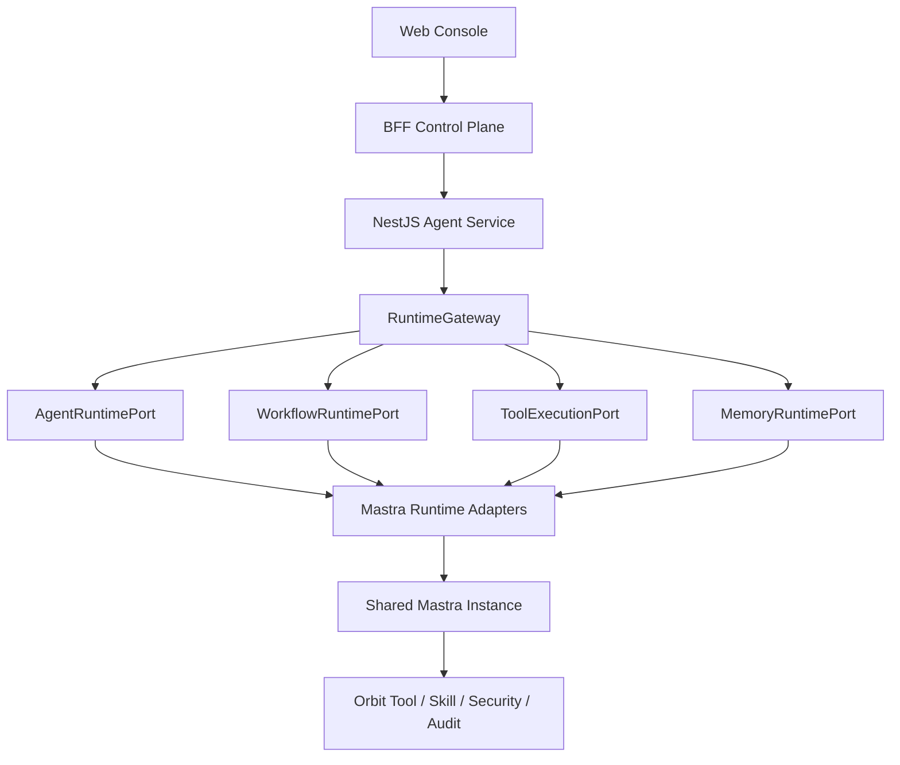

## Context

### 当前系统

Orbit 已形成四层产品结构：

- Web Console 负责 Agent 对话、SOP 画布和运行展示。
- BFF 负责 Agent/SOP 配置、发布版本、运行控制面、Skill Hub 和 SSE 转发。
- `packages/workflow-core` 负责 Workflow Draft/Version/IR、节点契约、运行快照和事件类型。
- `apps/agent-cli` 同时承担自研 Agent loop、Workflow scheduler、Tool orchestration、Memory、Streaming、daemon/host 和 HTTP service。

问题集中在 Agent 层：它既是产品服务，又在持续演化为通用 Agent 框架。若继续自研，会重复建设 Mastra 已提供的 Agent、Workflow、Tool、Memory、Streaming、Snapshot 和 Observability 能力，并让 PRD-115 阶段 E 的并行、循环、人工审批和恢复建立在不稳定内核上。

### Mastra 调研基线

截至 2026-07-24：

- `@mastra/core@1.52.1`、`@mastra/nestjs@0.2.9`、`@mastra/memory@1.23.1`、`@mastra/libsql@1.17.0`。
- 首轮配套版本固定为 `zod@3.25.76`、`@nestjs/common@11.1.27`、`@nestjs/core@11.1.27`、`@nestjs/platform-express@11.1.27`、`express@5.1.0`、`reflect-metadata@0.2.2`、`rxjs@7.8.2`。
- Mastra 为 Apache-2.0，核心包要求 Node.js `>=22.13.0`，当前 Node.js 24 满足要求。
- 依赖 spike 已在 Node.js `22.13.0` 与 `24.16.0`、pnpm `10.18.3`、TypeScript `5.9.3` 下完成安装、编译和运行验证。
- 根依赖使用 Zod 3.25.76，避免 `@mastra/core` 内 AI SDK v5 兼容层对 Zod 3 的 peer warning；`@mastra/memory` 自带的 Zod 4 保持包内隔离。
- Agent 适合开放式推理、模型自主选择 Tool 和停止时机；Workflow 适合步骤明确、数据流和控制流可预定义的 SOP。
- Workflow 支持顺序、分支、并行、foreach、循环、嵌套、stream、suspend/resume、snapshot 和 active-run restart。
- `.foreach()` 支持并发参数，但 `.parallel()` 没有内置并发上限。
- Tool 支持结构化 schema、hooks、payload transform 和 `abortSignal`。
- Memory 使用 `resource + thread` 隔离并依赖 storage provider。
- 官方 `@mastra/nestjs` 只支持 NestJS Express 平台，`MastraModule` 会注册 catch-all controller。
- NestJS spike 证明导入顺序是硬约束：MastraModule 先导入会接管根 `/health`，并让 catch-all 对 Orbit `/workflow-runs/:id/events` 提前返回 404；最后导入时 Orbit 路由优先且 `/internal/mastra` 正常工作。
- Mastra 原生 Workflow HTTP route 与 Orbit `/workflow-runs`、取消和 SSE shape 不一致。
- Agent `AbortSignal` 在当前版本收敛为 `finishReason = tripwire`，Workflow cancel 收敛为 `status = canceled`；Adapter 必须映射为 Orbit cancellation 契约，不能透传原值。
- Workflow cancel 会向当前 step 传播 AbortSignal，并阻止后续 step；未主动监听 signal 的 step 只能在完成后停止后续调度，因此 Tool/HTTP/Code executor 必须合作式响应取消。
- Mastra Agent/Workflow 原生 stream chunk 不提供可作为产品重连游标的稳定递增 event id，断线回放必须由 Orbit event journal 承担。
- 使用 LibSQL snapshot 可在进程重建后查询 suspended run，并以同一 runId resume；已成功的前置 step 不会因 resume 重放。
- Durable Agents、Signals、Schedules、Agent Controller 仍为 Beta。

首轮所有上述依赖使用精确版本，不使用 `^` 或 `~`。升级必须作为独立变更整体推进 Mastra core、Nest adapter、Memory、storage provider 与 Zod，并重新执行四个 Port contract matrix、Nest 路由冲突、取消、stream、snapshot 和重启恢复测试。Mastra 系列包使用 Apache-2.0；NestJS、Express、Zod、reflect-metadata 和 RxJS 使用其发布包声明的 MIT 许可证。

### 对齐后的核心结论

1. 最终只有一个 NestJS Agent Service，不对外暴露两套服务。
2. 最终只有一个可执行 Mastra Runtime，不长期保留可运行的 legacy runtime；历史源码可在仓库外层归档，但不得进入生产依赖图。
3. 对话和 Workflow 都通过稳定 Runtime Port 进入 Mastra，但按领域拆分接口。
4. Tool 和 Memory 也拥有独立执行端口，避免形成超级 RuntimePort。
5. Legacy 仅是限时迁移工具；session/run 创建后绑定后端，不允许中途切换。

## Goals / Non-Goals

**Goals:**

- 让 Mastra 完全替代自研 Agent/Workflow/Memory/Streaming 运行内核。
- 让 NestJS 成为 Agent service 的最终 HTTP、DI 和 lifecycle 宿主。
- 保持 Web、BFF、Skill Hub、SOP 画布和 `workflow-core` 产品协议稳定。
- 用四个小而清晰的 Runtime Port 隔离产品调用与 Mastra API。
- 对话、Workflow、Tool、Memory 最终都调用同一个 Mastra Instance 及其共享 storage/observability。
- 明确限时迁移、运行绑定、回滚、停止创建 legacy 运行和删除 legacy 的完整路径。
- 在不恢复可执行 Legacy 的前提下，保留一份 frozen、read-only、non-production 的迁移前教学源码归档。
- 在 Mastra Runtime 达到生产门槛前暂停 PRD-115 阶段 E。

**Non-Goals:**

- 不把 Mastra DSL 变成 SOP 持久化模型。
- 不让 Web/BFF 认识 Mastra 类型、状态或 chunk。
- 不使用一个包含 chat/workflow/tool/memory 全部方法的超级 Port。
- 不允许运行中自动 fallback 或重新执行副作用节点。
- 不让 Adapter 重新实现 Agent loop、Workflow scheduler 或 Memory engine。
- 不让历史归档进入 pnpm workspace、tsconfig、exports、构建、测试或生产运行路径。
- 本轮不实现代码，不修改 PRD-115 artifacts。

## Decisions

### 1. 最终架构是单一 NestJS Service + 单一 Mastra Runtime



最终 Agent 层不是自研框架，而是：

```text
NestJS Host
+ Runtime Ports
+ Mastra Adapters
+ Shared Mastra Instance
+ Orbit 产品治理服务
```

备选：Web/BFF 直接调用 Mastra。未采用，因为会让 Mastra API 成为产品协议，框架升级将扩散到所有端，并绕过本地 Tool、安全和 daemon 边界。

备选：长期保留 legacy 与 Mastra 双 Runtime。未采用，因为最终目标是完整替换，双轨只允许作为有退出条件的迁移机制。

### 2. 执行面与控制面严格分离

只有产生运行副作用或访问运行状态的请求进入 Runtime Ports：

| 请求类型 | 入口 |
| --- | --- |
| Agent generate/stream/run query/cancel | `AgentRuntimePort` |
| Workflow start/query/cancel/events/resume | `WorkflowRuntimePort` |
| Tool 直接执行或 Runtime 内 Tool 调用 | `ToolExecutionPort` |
| Memory thread/message 查询和写入 | `MemoryRuntimePort` |
| Agent 配置 CRUD、Skill 安装、SOP CRUD、发布、审计查询、系统设置 | 普通领域 Service |

Controller 负责 HTTP 解析和响应；Port 负责稳定执行契约；Adapter 负责 Mastra 翻译；Mastra 负责实际运行。

备选：所有 Agent Service 请求都经过 RuntimeGateway。未采用，因为配置、审计和 Skill 安装不是 Runtime 行为，会让执行边界重新膨胀。

### 3. RuntimeGateway 组合四个领域 Port

```ts
export interface RuntimeGateway {
  readonly agent: AgentRuntimePort;
  readonly workflow: WorkflowRuntimePort;
  readonly tools: ToolExecutionPort;
  readonly memory: MemoryRuntimePort;
}
```

`RuntimeGateway` 只做组合和注入，不做动态方法分发、业务编排或 fallback。

所有 Port 必须：

- 只依赖共享 product contracts 和标准 TypeScript 类型。
- 不暴露 Mastra、NestJS、Node HTTP、数据库 driver 或 framework stream 类型。
- 使用结构化 command/result/error。
- 将流表示为 `AsyncIterable` 或等价框架无关类型。

共享契约落在独立 workspace package `@orbit/runtime-contracts`。该包单向依赖 `@orbit/workflow-core` 以复用 Workflow Draft/Version、run snapshot 和 event 类型；`workflow-core` 不反向依赖 Runtime Ports。Web、BFF 和 Agent 后续均从该包消费 Agent、Workflow、Tool、Memory Port，避免把非 Workflow 领域契约塞入 `workflow-core`。

备选：创建一个 `RuntimePort`，包含 chat、workflow、tool、memory 所有方法。未采用，因为它会形成新的大一统框架接口，破坏单一职责。

### 4. AgentRuntimePort 承担对话执行兼容

概念接口：

```ts
export interface AgentRuntimePort {
  capabilities(): Promise<AgentRuntimeCapabilities>;
  generate(command: GenerateAgentCommand): Promise<AgentRunResult>;
  stream(command: StreamAgentCommand): AsyncIterable<AgentRuntimeEvent>;
  getRun(runId: string): Promise<AgentRunSnapshot | null>;
  cancel(command: CancelAgentRunCommand): Promise<AgentRunSnapshot>;
}
```

`GenerateAgentCommand` / `StreamAgentCommand` 携带稳定的 agent version、sessionId、resourceId、threadId、request context 和允许的 Tool/Skill。Session CRUD 仍属于普通 session service；Runtime Port 只消费其权威绑定和上下文。

Mastra Agent Adapter 将调用：

```text
mastra.getAgentById(agentId).generate()
mastra.getAgentById(agentId).stream()
```

并把 text、tool input delta、tool call、tool result、usage、final result 转换成现有 Agent SSE/stream 契约。

备选：继续让 chat controller 直接调用自研 Agent loop。未采用，因为这与完全替换目标冲突，也会让对话和 Workflow 使用不同运行内核。

### 5. WorkflowRuntimePort 承担 SOP 执行兼容

概念接口：

```ts
export interface WorkflowRuntimePort {
  capabilities(): Promise<WorkflowRuntimeCapabilities>;
  start(command: StartWorkflowRunCommand): Promise<WorkflowRunSnapshot>;
  get(runId: string): Promise<WorkflowRunSnapshot | null>;
  cancel(command: CancelWorkflowRunCommand): Promise<WorkflowRunSnapshot>;
  events(query: WorkflowRuntimeEventQuery): AsyncIterable<WorkflowRuntimeEvent>;
  resume(command: ResumeWorkflowRunCommand): Promise<WorkflowRunSnapshot>;
}
```

`workflow-core` 的 Draft/Version/IR 继续是权威产品模型。Mastra Workflow Adapter 根据 IR 生成可重建执行产物，并按以下 key 缓存：

```text
workflowId + versionId/contentHash + adapterVersion
```

节点映射：

| Orbit IR | Mastra |
| --- | --- |
| Start/End | Workflow input/output |
| LLM | Mastra Agent step |
| Tool | Mastra Tool step |
| HTTP/Code/Template/Variable/Knowledge | typed step，内部委托现有服务 |
| Condition/Switch | `.branch()` 或等价路由 |

`StartWorkflowRunCommand` 额外携带框架无关的 `requestContext`。其中 `ownerId` 由 Agent Service 的认证或本地宿主边界注入，不作为 Mastra 原生字段暴露给 Web/BFF；包含 Tool 节点的运行若缺少 `ownerId`，必须在创建前明确拒绝。Workflow Tool step 将该上下文转换为 `executor.kind = workflow`、product runId 和 nodeId，确保不会为了接入 Mastra 而伪造所有权或绕过 Tool 治理。

备选：让 SOP 画布保存 Mastra Workflow DSL。未采用，因为会破坏版本迁移、产品校验、未来框架替换和现有 Web/BFF 契约。

### 6. ToolExecutionPort 统一直接调用与 Runtime 内调用

概念接口：

```ts
export interface ToolExecutionPort {
  list(context: ToolListContext): Promise<ToolDescriptor[]>;
  execute(command: ExecuteToolCommand): Promise<ToolExecutionResult>;
}
```

Mastra Tool Adapter 只做薄包装：

- Tool ID、description、schema 来自现有 Tool/Skill 解析结果。
- `execute` 委托 `ToolExecutionPort`。
- Port 内继续执行权限、审批、安全、凭据、审计和错误上抛。
- Mastra `abortSignal` 传播到底层执行器。

这样 Agent 调 Tool、Workflow Tool 节点和现有 Tool API 使用同一执行边界。

备选：把全部 Orbit Tool 改写为独立 Mastra Tool 实现。未采用，因为会复制安全和审计逻辑，并扩大迁移范围。

### 7. MemoryRuntimePort 与 Mastra Memory 使用同一身份映射

概念接口：

```ts
export interface MemoryRuntimePort {
  createThread(command: CreateMemoryThreadCommand): Promise<MemoryThread>;
  getThread(query: GetMemoryThreadQuery): Promise<MemoryThread | null>;
  listThreads(query: ListMemoryThreadsQuery): Promise<MemoryThreadPage>;
  deleteThread(command: DeleteMemoryThreadCommand): Promise<void>;
  listMessages(query: ListMemoryMessagesQuery): Promise<MemoryMessagePage>;
  appendMessages(command: AppendMemoryMessagesCommand): Promise<void>;
}
```

身份映射固定为：

```text
Orbit user/project/owner -> Mastra resource
Orbit session/conversation -> Mastra thread
```

AgentRuntimePort 传入相同 resource/thread，Mastra Agent 使用 Mastra Memory；Memory API 通过 MemoryRuntimePort 操作同一存储和所有权规则。

首轮启用 message history；working memory 与 semantic recall 分阶段验证；Observational Memory 默认关闭。Legacy 数据通过版本化 namespace 一次性或按需迁移，不长期双写。

备选：Agent 对话使用 Mastra Memory，但 Memory API 继续读 legacy store。未采用，因为会产生两个权威源和会话不一致。

### 8. 四个 Adapter 共享同一个 Mastra Instance

```ts
const mastra = new Mastra({
  agents,
  workflows,
  storage,
  logger,
  observability,
});
```

```text
MastraAgentRuntimeAdapter   -> shared Mastra instance
MastraWorkflowRuntimeAdapter -> shared Mastra instance
MastraToolExecutionAdapter -> shared Mastra instance / ToolExecutionPort
MastraMemoryRuntimeAdapter -> shared Mastra storage
```

共享实例提供统一 Agent registry、Workflow registry、Tool registry、Memory storage、trace 和生命周期。动态 Workflow 可按 IR 构建并缓存，但仍使用同一 Mastra runtime infrastructure。

Adapter 不得实现自己的循环、调度或恢复引擎；若 Mastra 无法满足非协商产品语义，应在 capability gate 失败，而不是在 Adapter 内重建一套隐藏 Runtime。

### 9. Agent 与 Workflow 使用各自规范化事件协议

Agent 对话和 Workflow 的事件语义不同，不强行合并成一个事件联合：

- `AgentRuntimeEvent`：text delta、tool input、tool call、tool result、usage、status、final result。
- `WorkflowRuntimeEvent`：run/node status、node log、node output、run output、waiting。

两者共享最小 envelope：

```ts
type RuntimeEventBase = {
  id: number;
  runId: string;
  at: number;
};
```

Orbit event journal 为每个 run 分配严格递增 id，支持 `Last-Event-ID` / `since_id` 回放。Mastra 内部 chunk 序号不得直接成为产品游标。

备选：把 Mastra `fullStream` 原样透传。未采用，因为会泄漏框架协议、安全数据，并使 Mastra 升级成为 Web/BFF breaking change。

### 10. Session/Run 在创建时显式绑定 Runtime Backend

迁移期间允许 `legacy | mastra`，但绑定只发生一次：

```text
Agent session/run created -> persist runtimeBackend
Workflow run created      -> persist runtimeBackend
```

后续所有操作根据持久绑定路由：

```text
get / cancel / events / resume -> original runtimeBackend
```

约束：

- 运行或会话创建后不得中途切换。
- Mastra 运行失败后不得自动在 legacy 重跑。
- SSE 断开不得触发 backend 切换。
- 能力不足必须在创建前拒绝，或由明确 canary policy 在创建前选择 legacy。
- rollback 只影响新建 session/run，活动运行继续由原 backend 管理。

备选：`mastra-default` 在运行时自动 fallback。未采用，因为会模糊边界、破坏 Memory 连续性，并可能重复副作用。

### 11. NestJS 是宿主，不是 Runtime

最终模块建议：

```text
AgentAppModule
├── RuntimeGatewayModule
├── AgentRuntimeModule
├── WorkflowRuntimeModule
├── ToolExecutionModule
├── MemoryRuntimeModule
├── SessionsModule
├── SkillsModule
├── SecurityModule
├── AuditModule
├── McpModule
└── MastraModule（最后导入，/internal/mastra）
```

`@mastra/nestjs` 使用 Express 平台，挂载 `/internal/mastra`，只用于内部诊断/Studio 或开发。`MastraModule` 必须最后导入；其 `/health`、`/ready`、`/info` 根路由与 catch-all 都需要通过导入顺序保证 Orbit 产品 controller 优先匹配。BFF 不直接转发 Mastra 原生 route。

宿主迁移晚于 Port 和 Mastra Adapter 验证，避免一次性同时改变 Runtime 和 HTTP 框架。

备选：先迁移 Nest，再接 Mastra。未采用，因为会先承担一次大规模路由迁移，却没有推进核心 Runtime 替换目标。

### 12. Legacy 是限时迁移机制，必须有删除阶段

迁移阶段：

1. `legacy-only`：端口化当前实现，产品行为不变。
2. `explicit-canary`：只有明确白名单的新 session/run 绑定 Mastra。
3. `mastra-default-new`：新 session/run 默认 Mastra；存量继续原绑定。
4. `legacy-create-disabled`：停止创建 legacy session/run，只处理存量查询、取消和排空。
5. `mastra-only`：迁移/关闭剩余 legacy 状态。
6. `legacy-removed`：从 `apps/agent-cli` 与生产依赖图删除 legacy runtime、adapters、selector、旧 Memory/Streaming 和 raw HTTP host；历史源码仅可保留为隔离归档。

Shadow 只允许在测试环境对 side-effect-free 场景使用，不作为生产运行模式。

完成标准不是“Mastra 流量达到某比例”，而是代码和运行状态完成收口，仓库中不再存在可执行 legacy Agent/Workflow 内核。位于 `archive/legacy-agent-runtime/`、不参与 workspace、构建、测试、exports 且不被生产代码引用的历史源码不视为可执行 Legacy。

### 13. Legacy 教学源码只读归档

迁移前自研教学版 Agent Runtime 以原目录结构保存在：

```text
archive/legacy-agent-runtime/apps/agent-cli/src/**
```

归档约束：

- 归档根目录必须提供 `README.md`，明确标记 `frozen`、`read-only`、`non-production`。
- 只保存迁移基线的历史源码和目录结构，不提供可直接运行的 package、workspace、tsconfig、exports、启动脚本或测试入口。
- `apps/agent-cli`、NestJS modules、RuntimeGateway、Mastra adapters 和 workspace packages 不得导入或动态加载归档文件。
- 根 `pnpm-workspace.yaml`、任何生产 `tsconfig`、package exports、构建与测试 glob 不得纳入该目录。
- 归档不是 rollback Runtime。若需要研究或复用其中设计，必须通过新的 OpenSpec 重新设计和实现，不得直接连接生产路径。

该决策保留教学和架构演进参考，同时不改变“唯一生产 Runtime 是 Mastra”的完成标准。

## Risks / Trade-offs

- [Port 数量增加] → 每个 Port 保持单职责，由 RuntimeGateway 组合；禁止跨 Port 复制业务逻辑。
- [Mastra API 快速演进] → 锁定精确版本，所有 Mastra 类型留在 adapters 内，升级执行全量 contract matrix。
- [取消能力可能不足] → 作为 Mastra 切换硬门槛；失败则等待升级或调整产品决策，不在 Adapter 重建 scheduler。
- [`.parallel()` 无并发上限] → PRD-115 阶段 E 暂停，验证受控编译方案后再开放。
- [Memory 迁移串线或丢失] → 固定 resource/thread 映射、所有权检查、版本化 namespace 和迁移审计。
- [双 Runtime 边界模糊] → 只在创建时绑定，持久化 backend，禁止中途 fallback，提供 legacy 删除任务。
- [Nest catch-all 冲突] → Express-only、独立内部前缀、最后导入、完整路由冲突测试。
- [Adapter 变成第二套框架] → 设定约束：Adapter 只翻译，不实现 Agent loop、Workflow scheduler 或 Memory engine。
- [Beta 能力变化] → 首轮核心路径不依赖 Durable Agents、Signals、Schedules、Agent Controller。
- [归档被误接回生产] → 固定归档目录、README 警示和依赖边界测试；禁止 workspace/tsconfig/exports/构建/测试收录以及任何活动源码引用。

## Migration Plan

### Phase 0：冻结与基线

1. 冻结 legacy Agent/Workflow/Memory/Streaming 的新能力。
2. 固化 Agent、Workflow、Tool、Memory、SSE、取消、daemon 契约测试。
3. 完成 Mastra/Nest/Node/storage 兼容 spike。

### Phase 1：四个 Port 端口化

1. 定义 RuntimeGateway 和四个领域 Port。
2. 使用 legacy adapters 包装现有实现。
3. Controller 改为依赖 Ports，运行仍全部走 legacy。

### Phase 2：共享 Mastra Instance 与四个 Adapter

1. 在现有 raw HTTP host 内创建 Mastra instance。
2. 实现 Agent、Workflow、Tool、Memory adapters。
3. 验证事件归一化、取消、snapshot、resource/thread 和 P0 Workflow。

### Phase 3：显式 Canary 与不可变绑定

1. 仅允许白名单的新 Agent session/run 和 Workflow run 绑定 Mastra。
2. 持久化 runtimeBackend、adapterVersion、Mastra run/thread 映射。
3. 查询、取消、事件和恢复严格按原绑定路由。

### Phase 4：NestJS 宿主迁移

1. 按领域迁移 Agent service controllers/modules。
2. 最后导入 `/internal/mastra`。
3. 验证 daemon lock、graceful shutdown、SSE、MCP、health/ready。

### Phase 5：Mastra 默认与 Memory 迁移

1. 新建 session/run 默认绑定 Mastra。
2. 迁移 legacy Memory 和需要延续的历史 session。
3. 停止创建新的 legacy session/run。

### Phase 6：Legacy 排空与删除

1. 排空、终止或显式失败剩余 legacy 活动运行。
2. 验证 Mastra-only 全量回归和发布窗口。
3. 将迁移前教学源码冻结到隔离归档，并从 `apps/agent-cli`、workspace 和生产依赖图删除 legacy runtime、adapters、selector、旧 Memory/Streaming 和 raw HTTP host。

### Rollback

- 在停止 legacy 创建前，rollback policy 可让新 session/run 重新绑定 legacy。
- 已创建的 session/run 永远使用原 backend，不做运行中迁移或重放。
- 已关闭 legacy 创建后，若 Mastra 出现问题，应停止新运行并修复/回退发布版本，而不是重新启用已删除的隐式 fallback。
- 历史归档不属于 rollback 机制，不得通过配置、动态 import 或路径映射重新接入生产。
- Mastra storage、run mapping 和 event journal 保留用于诊断，不覆盖产品数据。

## PRD-115 阶段 E 恢复门槛

阶段 E 按 capability 独立恢复。每项能力只有在与自身相关的以下门槛通过后才能进入验收；某项失败只关闭该项及其显式依赖能力：

1. Parallel/Merge 并发上限为 10，失败和取消不会泄漏后续执行。
2. Iteration/Loop 有最大并发、次数、总时长和输出体积硬限制。
3. Nested Workflow 固定不可变版本，run/node identity 和事件稳定。
4. Agent 节点使用 AgentRuntimePort/Mastra Agent，并保持 Tool/Memory 隔离。
5. Human Approval 的 suspend/resume、snapshot、重复 resume 幂等和重启恢复通过。
6. Agent 与 Workflow SSE 都支持断线重连、游标回放和终态关闭。
7. Agent 与 Workflow cancel 都能传播并收敛稳定终态。
8. 10 个并发运行和持续 SSE 性能基线通过。

2026-07-30 的最终结果为：Iteration、Loop、Nested Workflow、Agent、Human Approval 和 restart/resume 已通过对应门槛；Parallel/Merge 的受限并发、聚合和父取消已通过，但 Mastra 1.52.1 与最新稳定 1.55.0 都不能在 foreach fail-fast 时取消已活动 sibling，因此 `parallelMerge` 继续关闭。六项已通过能力进入独立验收，不自动修改 PRD-115 tasks。

## Open Questions

- 已确认 Workflow cancel 会传播 AbortSignal 并停止后续 step；各执行器仍必须主动响应 signal 才能及时中止当前 step。
- Agent run 的持久事件 journal 与 Workflow journal 是否共用一套 store、分表保存，需要性能测试决定。
- P0 LLM 节点是复用注册 Agent 还是生成轻量节点 Agent，需要比较 model policy、trace 和缓存成本。
- Legacy Memory 采用批量导入还是访问时迁移，需要盘点数据规模和保留要求。
- 生产环境是否完全关闭 Mastra 原生路由，或保留仅 localhost 可访问的诊断前缀，需要安全评审。

## Reference Baseline

- Mastra Get Started：https://mastra.ai/docs
- Agents Overview：https://mastra.ai/docs/agents/overview
- Tools：https://mastra.ai/docs/agents/using-tools
- Workflows Overview：https://mastra.ai/docs/workflows/overview
- Workflow Control Flow：https://mastra.ai/docs/workflows/control-flow
- Workflow Snapshots：https://mastra.ai/docs/workflows/snapshots
- Memory：https://mastra.ai/docs/memory/overview
- Server Adapters：https://mastra.ai/docs/server/server-adapters
- NestJS Adapter：https://mastra.ai/reference/server/nestjs-adapter
- Server Routes：https://mastra.ai/reference/server/routes
- Durable Agents Beta：https://mastra.ai/docs/long-running-agents/durable-agents
